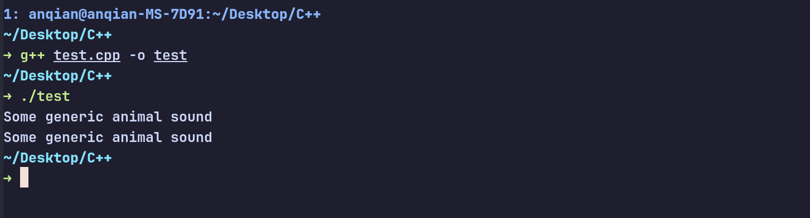

> # 浅谈虚函数

在C++中，虚函数作为实现多态性的重要机制，允许程序在运行时决定调用哪一个函数版本。本文将简要介绍虚函数的使用方法及其设计理念，帮助你更好地理解和应用虚函数。

> ## 你为什么需要虚函数？

假设你现在面对着两个类，`Dog`类和`Cat`类，它们都继承自一个基类`Animal`。每个类都有一个叫做`make_sound`的函数，用于输出动物的叫声。你可能会想，我完全可以直接调用`Dog`类和`Cat`类的`make_sound`函数，为什么还要用虚函数呢？

想象一下，你可能需要一个`vector`来存储不同类型的动物对象。你的`vector`中的类型应该是`Animal`的对象或者指针或者引用，因为你要将`Dog`和`Cat`都存储到同一个容器中去。那么，存储到了容器中之后，你的`Dog`对象和`Cat`对象
都会被当作`Animal`类型来处理。如果你直接调用`make_sound`函数，编译器会根据`Animal`类型来决定调用哪个函数版本，这显然不是你想要的结果。也许这个时候你会灵机一动，使用条件语句来判断对象的实际类型，然后调用相应的函数版本不就可以了？代码段如下所示:

```cpp
#include <iostream>
#include <memory>
#include <vector>

class Animal {
public:
  Animal() = default;
  void make_sound() { std::cout << "Some generic animal sound" << std::endl; }
};

class Dog : public Animal {
public:
  Dog() = default;
  void make_sound() { std::cout << "Woof!" << std::endl; }
};

class Cat : public Animal {
public:
  Cat() = default;
  void make_sound() { std::cout << "Meow!" << std::endl; }
};

int main() {

  std::unique_ptr<Animal> my_dog = std::make_unique<Dog>();
  std::unique_ptr<Animal> my_cat = std::make_unique<Cat>();
  std::vector<std::unique_ptr<Animal>> animals;
  animals.emplace_back(std::move(my_dog));
  animals.emplace_back(std::move(my_cat));

  for (const auto &animal : animals) {
    if (typeid(*animal) == typeid(Dog)) {
      Dog *dog = static_cast<Dog *>(animal.get());
      dog->make_sound();
    } else if (typeid(*animal) == typeid(Cat)) {
      Cat *cat = static_cast<Cat *>(animal.get());
      cat->make_sound();
    } else {
      animal->make_sound();
    }
  }

  return 0;
}
```

上面的代码的运行结果如下所示：


诶？你可能会奇怪，为什么输出的结果不是预期的"Woof!"和"Meow!"，而是"Some generic animal sound"？这是因为在`Animal`类中，`make_sound`函数并不是虚函数，`typeid`在检测非多态类的情况下，得到的是编译期的类型，而不是运行期的类型，也就是说，当你把`Dog`对象和`Cat`对象存储到`Animal`类型的容器中时，
由于类型转换已经完成，而且没有使用虚函数，那么原本的类型信息就已经丢失了，编译器只能根据`Animal`类型处理。
那么，如何解决这个问题呢？你也许会说，可以多定义几个`vector`来存储不同类型的动物对象，然后分别调用它们的`make_sound`函数，不就可以了吗？那么，如果说将来你还要添加更多的动物类型，比如`Bird`类、`Fish`类等等，你是不是又要定义更多的`vector`来存储它们？这显然不是一个好的设计方案。那么，为了解决这个问题，比较优雅的做法就是使用虚函数。通过在基类`Animal`中将`make_sound`函数声明为虚函数，编译器就会在运行时根据对象的实际类型来决定调用哪个函数版本。修改后的代码如下所示：

```cpp
#include <iostream>
#include <memory>
#include <vector>

class Animal {
public:
  Animal() = default;
  virtual void make_sound() {
    std::cout << "Some generic animal sound" << std::endl;
  }
};

class Dog : public Animal {
public:
  Dog() = default;
  void make_sound() override { std::cout << "Woof!" << std::endl; }
};

class Cat : public Animal {
public:
  Cat() = default;
  void make_sound() override { std::cout << "Meow!" << std::endl; }
};

int main() {

  std::unique_ptr<Animal> my_dog = std::make_unique<Dog>();
  std::unique_ptr<Animal> my_cat = std::make_unique<Cat>();
  std::vector<std::unique_ptr<Animal>> animals;
  animals.emplace_back(std::move(my_dog));
  animals.emplace_back(std::move(my_cat));
  for (const auto &animal : animals) {
    animal->make_sound();
  }
  return 0;
}
```

这里我们将`Animal`类中的`make_sound`函数声明为虚函数，并在`Dog`类和`Cat`类中使用`override`关键字来表示我们正在重写基类的虚函数。运行修改后的代码，输出结果如下所示：


通过使用虚函数，我们成功地实现了多态性，程序能够根据对象的实际类型来调用相应的函数版本。

关于虚函数的原理，我在讲述C++四种类型转换的`dynamic_cast`时有过介绍，请参考[详解C++四种类型转换](https://blog.anqian.me/posts/tech0_type_cast/%E8%AF%A6%E8%A7%A3c%E5%9B%9B%E7%A7%8D%E7%B1%BB%E5%9E%8B%E8%BD%AC%E6%8D%A2/)，在此不再过多赘述，本文我们主要讨论一些设计理念上的东西。例如，什么函数应该被设计为虚函数，那么你又是否应该设计为纯虚函数呢？

> ## 你在什么情况下需要使用虚函数？

一般来说，以下几种情况适合使用虚函数：
1. **基类中的函数需要在派生类中被重写**：如果你希望派生类能够提供自己的实现，那么将该函数声明为虚函数是合适的。
2. **需要通过基类指针或引用调用派生类的函数**：当你需要通过基类的指针或引用来调用派生类的函数时，虚函数是必不可少的。
3. **实现接口或抽象类**：如果你正在设计一个接口或抽象类，虚函数是实现多态性的关键。
4. **需要动态绑定**：当你希望在运行时根据对象的实际类型来决定调用哪个函数版本时，虚函数是必要的。

> ## 是否应该设计为纯虚函数？

在设计类时，你可能会面临一个选择：是使用缺省函数（即在基类中提供一个默认实现的虚函数），还是使用纯虚函数（即在基类中声明为纯虚函数，没有实现）。也许在你看来，后者和前者的区别仅仅在于它会使得基类成为抽象类，不能被实例化。但实际上，这两者在设计理念上有着更深层次的区别。使用缺省函数意味着你希望基类提供一个通用的实现，派生类可以选择重写它，也可以使用基类的默认实现。而使用纯虚函数则表示你希望派生类必须提供自己的实现，基类本身并不关心具体的实现细节。

我们可以来看这样的一个例子，这个例子来自 *Effictive C++* 。有一家航空公司，他们有着不同类型的飞机，每一个飞机上都有着用来控制飞行的函数`fly()`。对于不同类型的飞机，`fly()`函数的实现是不同的。那么，在设计这个类层次结构时，我们应该将`fly()`函数设计为缺省函数还是纯虚函数呢？
假设目前航空公司有两种类型的飞机，`PlaneA`和`PlaneB`，二者继承自基类`AirPlane`。由于两种类型的飞机在飞行模式上是相同的，因此，这家航空公司的设计师决定在基类`AirPlane`中提供一个缺省的`fly()`函数实现，二者都使用这个默认实现。代码如下所示：

```cpp
class AirPlane {
public:
  AirPlane() = default;
  virtual ~AirPlane() = default;
  virtual void fly() {
    // ...
    std::cout << "AirPlane is flying" << std::endl;
  };
};

class PlaneA : public AirPlane {
public:
  PlaneA() = default;
  ~PlaneA() override = default;
};

class PlaneB : public AirPlane {
public:
  PlaneB() = default;
  ~PlaneB() override = default;
};
```

在上面的设计代码中，`AirPlane`类中的`fly()`函数是一个缺省函数，`PlaneA`和`PlaneB`类都继承了这个默认实现。这样设计的好处是，如果将来航空公司引入了一种新的飞机类型`PlaneC`，并且这种飞机的飞行模式与现有的飞机相同，那么我们就不需要为`PlaneC`类提供一个新的`fly()`函数实现，可以直接使用基类`AirPlane`中的默认实现，从而减少了代码的重复。

```cpp
class PlaneC : public AirPlane {
public:
  PlaneC() = default;
  ~PlaneC() override = default;
};
```

嗯~~~，一切看上去都是这么的美好，，，吗？

假设现在航空公司决定引入一种新的飞机类型`PlaneD`，这种飞机采用了一种全新的飞行模式，与现有的飞机完全不同。那么，在这种情况下，`PlaneD`类必须提供一个自己的`fly()`函数实现，否则它将继承基类`AirPlane`中的默认实现，这显然是不合适的。但是，由于基类`AirPlane`中的`fly()`函数是一个缺省函数，编译器并不会强制要求`PlaneD`类提供一个自己的实现，这可能会导致程序在运行时出现错误。如果一个粗心的程序员忘记为`PlaneD`类提供一个`fly()`函数实现，那么当程序运行时，调用`PlaneD`对象的`fly()`函数将会执行基类`AirPlane`中的默认实现，这显然是灾难的开始！就如同C++本身总是相信程序员可以完美的管理内存一样，C++依然把这个权利交给了程序员自己，但是从C++如此广泛和令人头疼的内存管理问题来看，相信程序员完美管理代码的能力，显然是一个错误的假设。因此我们可以考虑把像`fly()`函数这样的关键函数设计为纯虚函数，这样编译器就会强制要求所有派生类都提供一个自己的实现，从而避免了上述的问题。修改后的代码如下所示：

```cpp
class AirPlane {
public:
  AirPlane() = default;
  virtual ~AirPlane() = default;
  virtual void fly() = 0;
};
```

通过将`fly()`函数声明为纯虚函数，我们确保了所有派生类都必须提供一个自己的实现。如果仍然有一个粗心的程序员忘记为PlaneD类提供一个`fly()`函数实现，编译器将在编译时就会报错，从而将错误提前到了编译期，避免了运行时的灾难。然而，这样的设计也引入了大量的代码重复，因为每一个派生类都必须提供一个自己的`fly()`函数实现，即使它们的实现是相同的，这样做既增加了编程时的代码重复工作，也会导致编译产生的程序体积更臃肿。但是如你所见，世上任何事物都不是完美的，更何况小小的我们设计的不足称道的函数呢？因此，在设计类层次结构时，我们需要权衡使用缺省函数和纯虚函数的利弊，选择最适合当前需求的设计方案。

事实上，面对这个问题，还有着一些其他的解决方案，但是这些解决方案也都有着各自的优缺点，在此不再过多赘述，本文的目的是让你了解虚函数的设计理念，而不是给出一个完美的解决方案。希望通过本文的介绍，能够帮助你更好地理解虚函数的使用方法以及背后的设计理念，从而在实际编程中做出更明智的选择。
