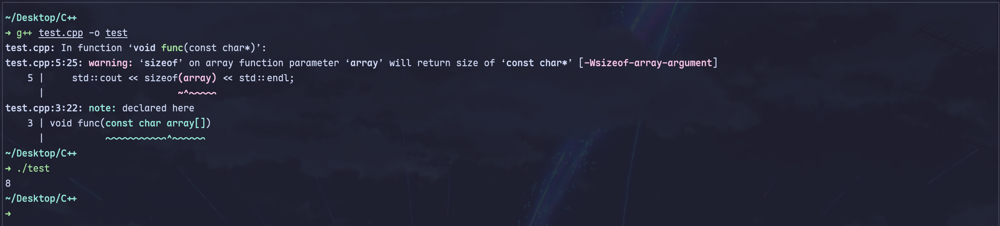
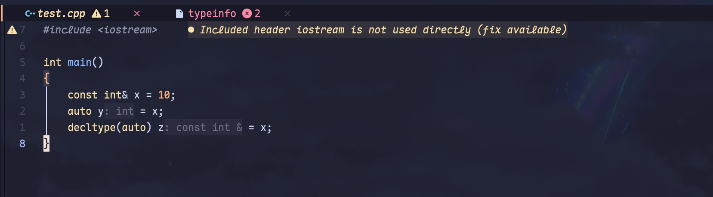
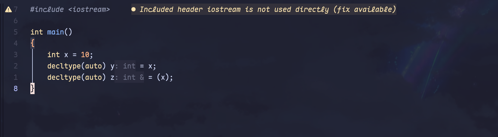

## auto类型推导与模板类型推导之间的坑

在使用模板的时候，大多数情况下的模板类型推导和`auto`类型推导是类似的，例如随便举一个下面的例子：

```cpp
template <typename T>
void f(const T&)
{
    std::cout << "Const reference specialization\n";
}

int main()
{
    int x = 10;
    f(x); // T被推导为int
    const auto& cx = x;
}
```

在大多数的情况下，T会被推导为`int`，但是只有在一种情况下`auto`的行为会表现的不一样，那就是在面对列表初始化的时候，我们慢慢来看。
首先我们来看下面的初始化代码：

```cpp
int main()
{
    int x1 = 10;
    int x2(10);
    int x3{ 10 };
    int x4 = { 10 };
}
```
在上面的代码中，这四个变量的类型都是`int`，没有任何区别，而且这段代码是完全可以正常通过编译的。
```cpp
int main()
{
    auto x1 = 10;
    auto x2(10);
    auto x3 { 10 };
    auto x4 = { 10 };
}
```

那么在上面的代码中，这四个变量的类型分别是什么呢？结果如下图所示：


可以看到，前三个变量的类型都是`int`，但是第四个变量的类型却变成了`std::initializer_list<int>`，这是因为在使用`auto`进行类型推导的时候，如果使用了列表初始化，那么`auto`会被推导为`std::initializer_list<T>`类型。至于为什么会这样设计，也许是为了引入统一的列表初始化语法而不得不承受的代价吧。然而讽刺的是，也正是因为这个缺陷设计，导致下面的代码无法通过编译：

```cpp
template <typename T>
void f(const T&)
{
    std::cout << "Const reference specialization\n";
}
int main()
{
    f( { 10 } ); // Error: cannot deduce template argument for 'T'
}
```

我们有理由相信，列表初始化没有被广泛采用的其中一个重要原因就是因为这个语义不清晰的坑，毕竟在大多数情况下，程序员并不希望`auto`被推导为`std::initializer_list<T>`类型。

## 数组的指针和引用的类型推导

在C++中，数组类型在作为函数参数传递的时候会发生指针退化，数组类型会退化为指向其第一个元素的指针类型。
```cpp
#include <iostream>

void func(const char array[])
{
    std::cout << sizeof(array) << std::endl;
}

int main()
{
    char array[] = "Hello, World!";
    func(array);
}

```



运行结果如上所示，输出的结果是8，这表明在函数`func`中，参数`array`实际上是一个指向`char`类型的指针，而不是一个数组类型。在类型推导中，数组类型也会发生类似的退化现象。而如果我们在auto字段之后添加一个`&`符号，理论上来说会取得`array`的引用，如下图所示：


在上面的例子中，`p`被推导为`char*`类型，而`r`被推导为`char (&)[14]`类型，这表明`r`是一个对包含14个`char`元素的数组的引用。这里的长度信息是很重要的，因为这个引用只能绑定到具有相同的长度的数组上，否则就会导致编译错误。根据这个特性，有一个比较好玩的用法，那就是我们甚至可以使用引用来获取数组的长度信息，而且在编译期就能做到，我们只需要写这样的一个函数：

```cpp
#include <iostream>

template <typename T, std::size_t N>
constexpr std::size_t array_size(T (&array)[N])
{
    return N;
}

int main()
{
    char array[] = "Hello, World!";
    std::cout << "Array size: " << array_size(array) << std::endl;
}
```

运行结果如下所示：


运用这个技巧，我们可以在编译期获取数组的长度信息，甚至可以直接获取到这个数组的长度，用来定义另一个与该数组长度相同的数组：

```cpp
#include <iostream>
template <typename T, std::size_t N>
constexpr std::size_t array_size(T (&array)[N])
{
    return N;
}
int main()
{
    char array[] = "Hello, World!";
    constexpr std::size_t size = array_size(array);
    char another_array[size]; // 定义一个与array长度相同的数组
    std::cout << "Another array size: " << sizeof(another_array) << std::endl;
}
```

## auto与decltype(auto)的区别

在C++14中引入了`decltype(auto)`，它与`auto`有一些重要的区别。`auto`在类型推导时会忽略引用和`const`修饰符，而`decltype(auto)`则会保留这些信息。如下图所示：



这本是一个很好的特性，但是实际使用中会有一个非常容易被忽略的坑。如下所示，`y` 和`z`的类型是否相同？如果不相同的话，各自应该是什么呢？
```cpp
#include <iostream>

int main()
{
    int x = 10;
    decltype(auto) y = x;
    decltype(auto) z = (x);
}
```

好，下面揭晓答案：



`y`的类型是`int`，而`z`的类型是`int&`。这是因为在`decltype(auto)`中，如果初始化表达式是一个括号包裹的变量，那么它会被视为一个左值引用，从而导致类型推导为引用类型。这种行为可能会导致一些意想不到的结果，尤其是在函数返回类型推导中。因此，在使用`decltype(auto)`时需要格外小心，确保理解其行为，以避免潜在的错误。
