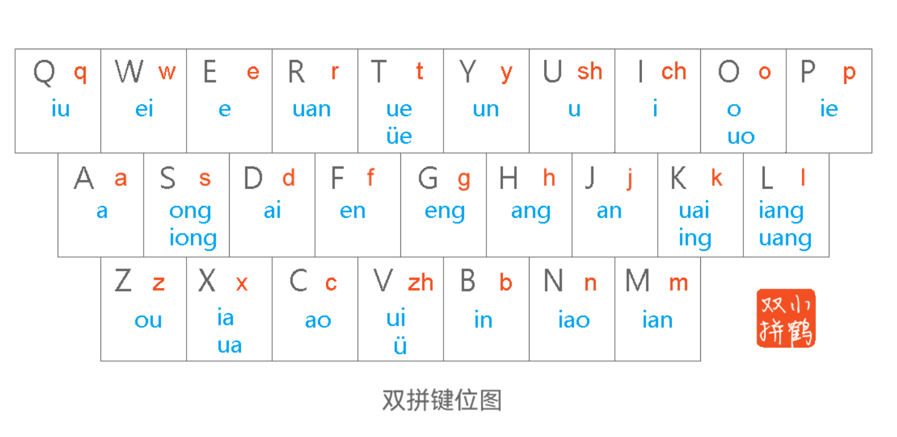

> 插件地址：[AQchance/flash-zh-simple.nvim](https://github.com/AQchance/flash-zh-simple.nvim)

## flash插件

Neovim的flash插件是一个非常强大的搜索和导航工具，它可以帮助用户快速定位到文件中的任何位置。它由Neovim社区大名鼎鼎的插件作者folke开发，基本功能根据字符、单词等进行快速跳转。

插件地址为[folke/flash.nvim](https://github.com/folke/flash.nvim)

flash最常用的最常用的几个功能包括：

- **字符快速跳转**：按下`s`键后，输入一个或多个字符，每一个匹配的位置都会被高亮显示，并且会在后面显示一个高亮的字母标签，用户只需按下对应的标签即可快速跳转到该位置。

- **对vim原生的f, F, t, T快捷键功能的扩展**：原生vim的f, F, t, T快捷键只能跳转到当前行内的某个字符，而flash插件则可以跨行进行跳转，极大地提升了跳转的灵活性和效率。

对于flash插件的完整功能不在此赘述，具体可以参考其官方文档。

## 对中文的适配工作

原版的flash插件只支持对于英文字符的跳转，并不支持对中文字符的跳转。但是由于写博客或者其他的一些需求的时候，往往全篇都是中文字符，而中文之间没有空格分隔，因此基本的w, e, b等跳转命令会很难用。因此基于自己的这个需求，我开始寻找是否有人开发过类似的插件，支持对中文字符的跳转。

经过一番搜索，我找到了[rainzm/flash-zh.nvim](https:github.com/rainzm/flash-zh.nvim)这个插件，这个插件是对原版flash插件的一个中文适配版本，支持对中文字符的跳转。这个插件对于中文的跳转是基于小鹤双拼输入法的编码规则来实现的，如果你使用的是小鹤双拼输入法，那么你使用这个插件就没有很大的压力。

举一个例子，假设我们要输入的内容是“中国”，那么在小鹤双拼中，“中”的拼音是“vs”，“国”的拼音是“go”，那么在使用这个插件进行跳转的时候，我们只需要输入“vsgo”即可根据标签快速跳转到“中国”，这显然极大的方便了中文用户的跳转需求。

小鹤双拼的键位布局如下图所示：



[小鹤音形官网](https://flypy.cc/)

但是很显然这个插件对我这样的只会使用全拼的用户很不友好，而且我并没有想要改变打字习惯的想法。因此我决定基于以上两个插件自己动手写一个简单的全拼插件。

## 插件实现

因为flash-zh.nvim这个插件已经实现了基本的功能了，因此我只需要把全拼映射到双拼的键位上，然后调用flash-zh.nvim的跳转函数即可，整体的实现逻辑还是比较简单的。

- 首先我们需要定义一个小鹤双拼的映射表，把全拼的声母和韵母映射到对应的键位上。对于声母来说，只有zh, ch, sh需要特殊映射，其他的声母都是单字符的，因此不需要特殊处理。对于韵母来说，我们需要把所有的小鹤双拼韵母都映射到对应的键位上。

```lua
-- 小鹤双拼映射表
local map = {
  -- 声母映射 (只有非单字符的需要特殊映射，zh, ch, sh)
  shengmu = {
    ["zh"] = "v",
    ["ch"] = "i",
    ["sh"] = "u",
  },
  -- 韵母映射
  yunmu = {
    ["iu"] = "q",
    ["ei"] = "w",
    ["e"] = "e",
    ["uan"] = "r",
    ["ue"] = "t", ["ve"] = "t",
    ["un"] = "y",
    ["u"] = "u", ["v"] = "v",
    ["i"] = "i",
    ["o"] = "o", ["uo"] = "o",
    ["ie"] = "p",
    ["a"] = "a",
    ["ong"] = "s", ["iong"] = "s",
    ["ai"] = "d",
    ["en"] = "f",
    ["eng"] = "g",
    ["ang"] = "h",
    ["an"] = "j",
    ["uai"] = "k", ["ing"] = "k",
    ["iang"] = "l", ["uang"] = "l",
    ["ou"] = "z",
    ["ua"] = "x", ["ia"] = "x",
    ["ao"] = "c",
    ["ui"] = "v",
    ["in"] = "b",
    ["iao"] = "n",
    ["ian"] = "m",
  }
}
```

- 我们需要实现一个转换函数，把输入的全拼字符串转换为小鹤双拼编码。这个函数需要分离声母和韵母的，然后根据映射表进行转换。

```lua
local function convert_single(pinyin)
  if pinyin == "" then return "" end

  local sm = ""
  local ym = ""

  -- 1. 尝试提取声母
  for _, s in ipairs(valid_shengmu) do
    if vim.startswith(pinyin, s) then
      -- 特殊情况：如果提取的声母会导致剩下的部分不是合法韵母，则可能不是这个声母
      -- 但中文拼音相对规范，贪婪匹配声母通常是正确的 (zh, ch, sh 优先于 z, c, s)
      sm = s
      ym = string.sub(pinyin, #s + 1)
      break
    end
  end

  -- 如果没找到声母，或者声母就是整个字符串（不应该发生，除非只有声母），则认为是零声母
  if sm == "" then
    ym = pinyin
    -- 特殊处理：flash-zh 对于部分零声母韵母，直接使用拼音作为键，而不是小鹤双拼码
    local special_zeros = {
      ["ai"] = true,
      ["an"] = true,
      ["ao"] = true,
      ["ei"] = true,
      ["en"] = true,
      ["ou"] = true,
      ["er"] = true, -- er 在小鹤里也是 er，这里一并处理
    }
    if special_zeros[ym] then
      return ym
    end
  end

  -- 2. 转换声母
  local double_sm = ""
  if sm == "" then
    -- 零声母规则：小鹤双拼中，零声母字的第一个键通常是韵母的首字母
    double_sm = string.sub(ym, 1, 1)
  else
    double_sm = map.shengmu[sm] or sm
  end

  -- 3. 转换韵母
  local double_ym = map.yunmu[ym]
  
  -- 如果找不到韵母映射，可能输入有误或者是单韵母直接映射
  if not double_ym then
    -- 容错：如果是单字母，可能就是它自己
    if #ym == 1 then double_ym = ym end
  end
  
  -- 特殊处理：如果没有韵母（例如用户只输了声母），暂不处理或返回声母
  if ym == "" then return double_sm end

  return double_sm .. (double_ym or "")
end

-- 主转换函数
-- 输入: "wo ai ni" or "zhongguo" (如果是连写的，这里的简单逻辑可能处理不了，建议空格分隔)
function M.to_xiaohe(input_str)
  local result = {}
  -- 简单的按非字母字符分割（支持空格、标点分隔）
  for word in string.gmatch(input_str, "[a-zA-Z]+") do
    table.insert(result, convert_single(string.lower(word)))
  end
  return table.concat(result, "")
end
```

- 在转换完成之后，我们只需要调用flash-zh.nvim的跳转函数即可。这里需要注意，在使用插件的时候，输入一个字的全拼之后应该使用空格间隔开来，以保证转换的正确性。因为中文拼音连在一起可能会导致歧义的发生，这种情况比较复杂，暂时没有处理。例如用户输入`xian`的时候，可能是`xi an（西安）`也可能是`xian（先）`，这两种情况应该区别开来。
```lua
-- 新增：输入全拼 -> 转双拼 -> 调用 flash-zh
function M.input_and_jump()
	vim.ui.input({ prompt = "输入全拼 (空格分隔): " }, function(input)
		if not input or input == "" then
			return
		end

		-- 1. 转换拼音
		local xiaohe = require("flash_zh_simple.xiaohe")
		local pattern = xiaohe.to_xiaohe(input)

		print("转换结果: " .. input .. " -> " .. pattern)

		-- 2. 调用 flash-zh
		-- 尝试加载 flash-zh
		local has_flash_zh, flash_zh = pcall(require, "flash-zh")

		-- 如果未找到，尝试将当前目录下的 flash-zh.nvim 加入 rtp (针对开发环境)
		if not has_flash_zh then
			local cwd = vim.fn.getcwd()
			local local_flash_path = cwd .. "/flash-zh.nvim"
			if vim.fn.isdirectory(local_flash_path) == 1 then
				vim.opt.rtp:prepend(local_flash_path)
				has_flash_zh, flash_zh = pcall(require, "flash-zh")
			end
		end

		if has_flash_zh then
			-- 使用 flash-zh 的 jump 接口
			-- 注意：flash-zh 的 jump 封装了 flash.jump，并自动处理模式
			-- 我们传入转换后的双拼码，但 flash-zh 默认是用来接收用户输入的
			-- 如果我们要直接跳转到 pattern，需要构造正确的 search 配置

			-- flash-zh 的 jump(opts) 实际上是打开 flash 界面让用户输。
			-- 但如果我们已经有了 text (pattern)，我们希望它直接跳。

			-- 查看 flash-zh 源码，它会调用 flash.jump(opts)。
			-- 我们可以直接调用 flash.jump，并复用 flash-zh 的模式。

			local flash = require("flash")
			-- 构造 flash-zh 的正则匹配器
			local search_mode = flash_zh.zh_mode -- 纯中文模式

			flash.jump({
				search = {
					mode = search_mode,
					text = pattern, -- 传入转换后的双拼码，直接搜索
				},
				label = { after = false, before = true },
				pattern = pattern,
			})
		else
			vim.notify("未找到 flash-zh.nvim，仅显示转换结果。", vim.log.levels.WARN)
		end
	end)
end

return M
```

- 另外，其实我的初衷是只想写一个简单的浮动窗口，用来展示小鹤双拼的键位图，方便自己查看。但是后来仔细一想，为什么不多走一步呢？于是我就把这个全拼功能也家了进来，这样一来，这个插件就比较方便像我这样只会使用全拼的用户使用了。尽管已经实现了全拼跳转的功能，但是键位图我还是保留了下来，毕竟双拼的跳转效率还是要高于全拼的。写这个插件的目的也许是让用户逐渐不要使用这个插件，转而使用flash-zh.nvim和双拼跳转，权且把该插件作为一个过渡工具吧。下面是浮动窗口的代码实现，不得不说，Neovim的API设计得还是很不错的，写起来并不复杂。而且Neovim的浮动窗口功能也非常强大，支持各种样式和配置，非常灵活。

```lua
-- 打开浮动窗口的主函数
function M.open()
	-- 1. 创建一个不可列出 (unlisted) 的临时缓冲区 (scratch buffer)
	-- 参数1: listed (false = 不在 :ls 中显示)
	-- 参数2: scratch (true = 这是一个临时 buffer，没有任何文件关联)
	local buf = vim.api.nvim_create_buf(false, true)

	-- 2. 获取编辑器的大小，用于计算居中位置
	local ui = vim.api.nvim_list_uis()[1]
	local width = 64
	local height = 16

	-- 计算起始行列，使窗口居中
	local row = math.floor((ui.height - height) / 2)
	local col = math.floor((ui.width - width) / 2)

	-- 3. 配置窗口选项
	local opts = {
		relative = "editor", -- 相对于整个编辑器定位
		width = width,
		height = height,
		row = row,
		col = col,
		style = "minimal", -- 最小化样式（无行号等）
		border = "rounded", -- 圆角边框 (也可选 "single", "double", "solid" 等)
		title = " 小鹤双拼 (Xiaohe) ", -- 窗口标题 (Neovim 0.9+)
		title_pos = "center",
	}

	-- 4. 打开浮动窗口
	-- 参数1: buffer id
	-- 参数2: enter (true = 焦点立即进入新窗口)
	-- 参数3: config table
	local win = vim.api.nvim_open_win(buf, true, opts)

	-- 5. 设置缓冲区内容
	local lines = {
		" [Q] iu         [W] ei         [E] e          [R] uan",
		" [T] ue         [Y] un         [U] sh / u     [I] ch / i",
		" [O] uo / o     [P] ie",
		"",
		" [A] a          [S] ong/iong   [D] ai         [F] en",
		" [G] eng        [H] ang        [J] an         [K] uai/ing",
		" [L] iang/uang",
		"",
		" [Z] ou         [X] ua/ia      [C] ao         [V] zh / ui",
		" [B] in         [N] iao        [M] ian",
		"",
		" --------------------------------------------------------",
		"  * 零声母：韵母首字母为零声母",
		"  * 按 'q' 关闭此窗口",
	}
	vim.api.nvim_buf_set_lines(buf, 0, -1, false, lines)

	-- 6. 设置按键映射：在 Normal 模式下按 'q' 关闭窗口
	-- 使用 <cmd>close<CR> 是关闭当前窗口最稳健的方法
	vim.keymap.set("n", "q", "<cmd>close<CR>", { buffer = buf, noremap = true, silent = true })

	-- 7. 设置 Buffer 选项：窗口关闭后自动销毁 Buffer
	vim.api.nvim_set_option_value("bufhidden", "wipe", { buf = buf })

	-- 可选：设置一些高亮或选项
	vim.api.nvim_set_option_value("cursorline", true, { win = win })
end
```

## 本插件的文档

本插件的完整代码和使用文档(含演示视频)可以参考GitHub仓库：[AQchance/flash-zh-simple.nvim](https://github.com/AQchance/flash-zh-simple.nvim)
